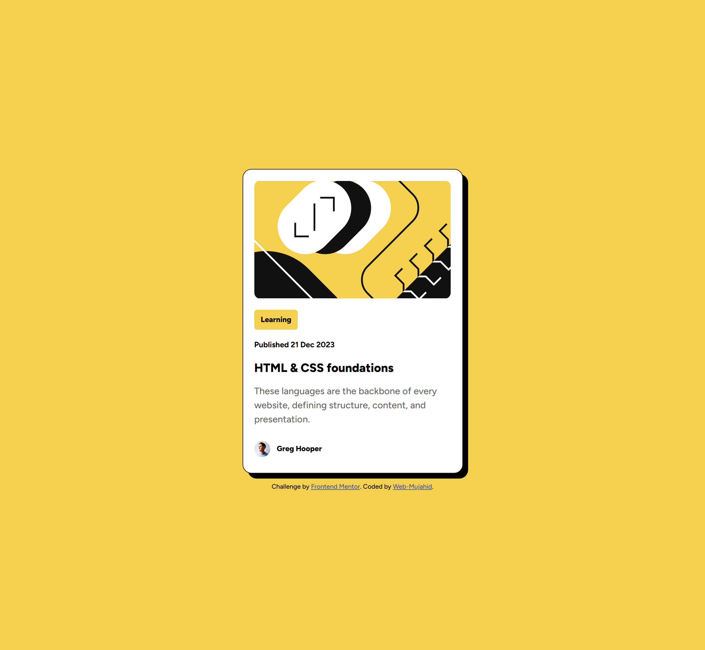
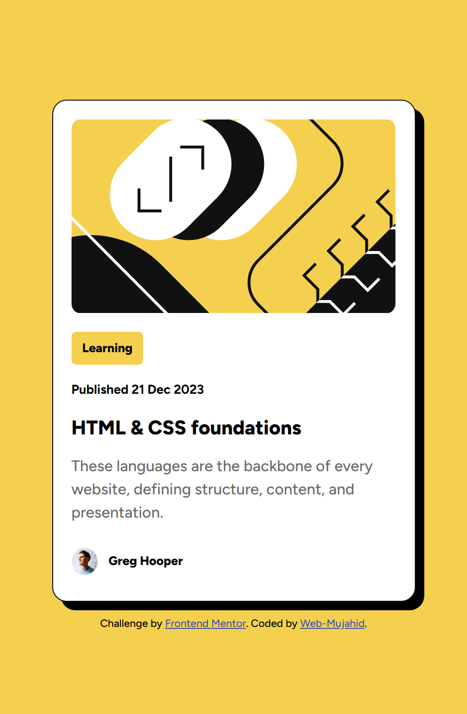

# Frontend Mentor - Blog Preview Card Component Solution

This is a solution to the [Blog Preview Card Component Challenge on Frontend Mentor](https://www.frontendmentor.io/challenges/blog-preview-card-component-XpS8cKZDWw). Frontend Mentor challenges help you improve your coding skills by building realistic projects.

---

## Table of Contents

- [Overview](#overview)
  - [Screenshot](#screenshot)
  - [Links](#links)
- [My Process](#my-process)
  - [Built With](#built-with)
  - [What I Learned](#what-i-learned)
  - [Continued Development](#continued-development)
- [Author](#author)

---

## Overview

### Screenshot

#### Desktop View


#### Mobile View


### Links

- Solution URL: [Add solution link here](#)
- Live Site URL: [Add live site link here](#)

---

## My Process

### Built With

- Semantic HTML5 markup
- CSS custom properties
- Flexbox
- Responsive design principles
- [Google Fonts](https://fonts.google.com/) for typography

### What I Learned

This project helped me solidify my understanding of the following concepts:

1. **CSS Variables**: Using variables like `--Yellow` and `--Gray500` to maintain consistency in colors.
2. **Flexbox Layouts**: Aligning content and building responsive components with `flex-direction` and `gap`.
3. **Typography**: Integrating the `Figtree` font for modern, professional styling.
4. **Responsive Design**:
   - Adjusting layout for mobile-first design using `max-width`.
   - Ensuring images and content scale dynamically for different screen sizes.

Here’s a snippet of code I’m proud of:
```css
.blog-container {
    display: flex;
    flex-direction: column;
    align-items: flex-start;
    background-color: var(--White);
    max-width: 23.5rem;
    padding: 1.2em;
    border-radius: 15px;
    border: 1px solid var(--Gray950);
    box-shadow: 0.55rem 0.55rem 0 rgba(0, 0, 0, 1);
    line-height: 1.5rem;
}

Continued Development

I plan to focus on:

1. Improving responsiveness for larger screens (e.g., tablets and desktops).


2. Exploring dynamic font scaling using clamp().


3. Enhancing hover effects with smooth transitions.


---

Author

Website - Web-Mujahid

Frontend Mentor - @Abdulgafar-Riro

GitHub - @Abdulgafar-Riro


---

Acknowledgments

Thanks to Frontend Mentor for the challenge and the resources provided!